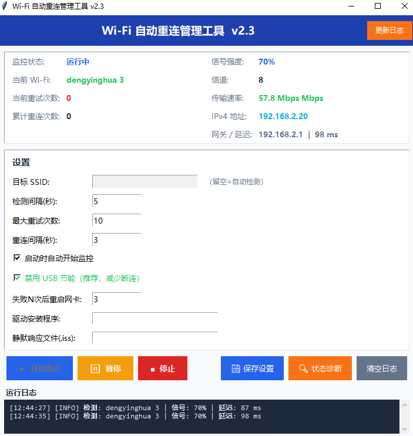

# Wi-Fi 自动重连管理工具 / Wi-Fi Auto-Reconnect Manager

> **Win10/Win11 Wi-Fi 自动重连管理工具**，可视化中文界面，支持 24 小时后台监控、智能重连、网卡重启、USB 节能优化。
>
> **A 24/7 Wi-Fi auto-reconnect tool for Windows 10/11** with a visual Chinese GUI, smart reconnection, adapter restart, and USB power-saving optimization.

---

## 功能特性 / Features

| 中文 | English |
|------|---------|
| **24 小时后台监控** — 实时检测 Wi-Fi 连接状态，信号强度、信道、传输速率一目了然 | **24/7 Background Monitoring** — Real-time Wi-Fi status detection with signal strength, channel, and transfer rate |
| **智能重连策略** — 三级渐进恢复：标准重连 → 网卡重启 → 驱动重装 | **Smart Reconnect Strategy** — Three-tier recovery: standard reconnect → adapter restart → driver reinstall |
| **网卡自动恢复** — 连续失败 N 次后自动重启无线网卡，解决驱动级断连 | **Auto Adapter Recovery** — Automatically restarts the wireless adapter after N consecutive failures |
| **USB 节能优化** — 禁用 Windows USB 选择性挂起，减少无线网卡意外断连 | **USB Power Saving Fix** — Disables Windows USB selective suspend to reduce unexpected disconnections |
| **硬件诊断** — 一键状态诊断，检测 Python、tkinter、网卡驱动等环境 | **Diagnostics** — One-click status check for Python, tkinter, adapter drivers |
| **日志记录** — 完整的运行日志，方便排查问题 | **Full Logging** — Complete runtime logs for troubleshooting |
| **后台静默启动** — 支持无命令行窗口的后台启动 | **Silent Background Start** — Start in the background with no command-line window |
| **配置持久化** — 所有设置自动保存到 JSON 配置文件 | **Persistent Config** — All settings auto-saved to a JSON config file |

---

## 截图预览 / Screenshot



---

## 文件结构 / File Structure

```
wifi-auto-reconnect/
├── wifi_monitor.py                  # 主程序 (Python 3 + tkinter)
├── 启动_WiFi监控.bat                 # 标准启动脚本
├── 启动_WiFi监控_诊断版.bat          # 诊断版启动脚本 (含环境检测)
├── 后台静默启动.vbs                  # 后台静默启动 (无 CMD 窗口)
├── 一键更新.bat                      # 一键更新脚本
├── README.md                        # 项目说明
├── .gitignore                       # Git 忽略配置
├── wifi-reconnect-landing.html      # 项目官网主页
├── docs.html                        # 使用文档
├── assets/
│   ├── interface_screenshot.png     # 软件界面截图
│   ├── hero_1280x720.jpg            # 官网背景图
│   └── interface_mockup_1024x576.jpg
├── _shared/fonts/
│   ├── Outfit-Bold.ttf
│   └── Outfit-Regular.ttf
└── win10_wifi_auto_reconnect.zip    # 完整打包下载
```

---

## 使用方法 / Quick Start

### 方式一：下载即用 (推荐)
1. 下载 [win10_wifi_auto_reconnect.zip](win10_wifi_auto_reconnect.zip)
2. 解压到任意文件夹
3. 双击 `启动_WiFi监控.bat` 即可运行

### 方式二：后台静默启动
双击 `后台静默启动.vbs` — 无命令行窗口，GUI 直接弹出。

### 方式三：诊断启动
双击 `启动_WiFi监控_诊断版.bat` — 先检测 Python、tkinter、语法等环境再启动。

### 方式四：一键更新
将新版 `win10_wifi_auto_reconnect.zip` 放入文件夹，双击 `一键更新.bat` 即可覆盖更新（配置文件保留）。

---

## 核心功能说明 / Core Functionality

### 三级智能重连策略 / Three-Tier Reconnect Strategy

| 阶段 | 失败次数 | 操作 | Tier | Failures | Action |
|------|---------|------|------|---------|--------|
| 标准重连 | 1–3 次 | netsh / PowerShell 重连连接 | Standard Reconnect | 1–3 | netsh / PowerShell reconnect |
| 网卡重启 | 4–6 次 | Disable/Enable 网卡设备 | Adapter Restart | 4–6 | Disable/Enable adapter device |
| 驱动重装 | 7–10 次 | InstallShield 静默重装驱动 | Driver Reinstall | 7–10 | InstallShield silent reinstall |

### 配置参数 / Config Parameters

所有参数可在 GUI 中设置，自动保存到 `wifi_monitor_config.json`：

| 参数 | 默认值 | 说明 | Parameter | Default | Description |
|------|--------|------|-----------|---------|-------------|
| 检测间隔 | 5 秒 | 每次检测 Wi-Fi 状态的间隔 | Check Interval | 5s | Interval between Wi-Fi checks |
| 最大重试次数 | 10 次 | 连续失败超过此值自动退出 | Max Retries | 10 | Auto-exit after this many failures |
| 重连间隔 | 3 秒 | 每次重试之间的等待时间 | Reconnect Delay | 3s | Wait time between retry attempts |
| 重启网卡阈值 | 3 次 | 失败 N 次后重启网卡 | Adapter Restart Threshold | 3 | Restart adapter after N failures |
| 目标 SSID | 留空 | 指定要监控的 Wi-Fi，留空则自动检测 | Target SSID | empty | Auto-detect if left blank |

---

## 系统要求 / System Requirements

- **操作系统 / OS**: Windows 10 / Windows 11
- **Python**: 3.x (安装时勾选 "tcl/tk and IDLE")
- **权限 / Permissions**: 管理员权限（用于网卡重启和 USB 节能设置）
- **无需额外运行时 / No additional runtime required**

---

## 在线访问 / Live Website

本项目利用 **GitHub Pages** 部署了官方网站，无需额外服务器即可在线访问：

- **项目主页 / Homepage**: [https://maxon46.github.io/wifi-auto-reconnect/wifi-reconnect-landing.html](https://maxon46.github.io/wifi-auto-reconnect/wifi-reconnect-landing.html)
- **使用文档 / Documentation**: [https://maxon46.github.io/wifi-auto-reconnect/docs.html](https://maxon46.github.io/wifi-auto-reconnect/docs.html)

> GitHub Pages 是 GitHub 提供的免费静态网站托管服务，只需开启仓库的 Pages 功能即可自动部署，零成本、零维护。

---

## 更新日志 / Changelog

**v2.3** (2026-07-14)
- 修复手动关闭 WLAN 开关(无线电)后无法重连的问题
- ensure_wlan_enabled 升级为网卡+无线电双重检查
- smart_reconnect 扫描不到网络时自动重启网卡再扫描

**v2.2** (2026-07-14)
- 新增 USB 选择性挂起禁用功能
- 新增网卡设备级重启 (Disable/Enable-NetAdapter)
- 实现分阶段重试策略：标准重连 → 网卡重启 → 驱动重装
- GUI 新增 USB 节能优化、网卡重启阈值、驱动路径配置选项

**v2.1** (2026-07-14)
- 重写 WiFi 信息获取函数，修复连接状态误判
- 优化检测逻辑：扫描可用网络并匹配已保存配置

**v2.0** (2026-07-13)
- 更换主题风格为 SaaS Blue + Orange 配色方案
- 新增网络延迟显示 (ping baidu.com)

**v1.0** (2026-07-12)
- 初始版本发布，24 小时后台自动检测 Wi-Fi 连接状态

---

## 许可证 / License

MIT License © 2026 Maxon46
 